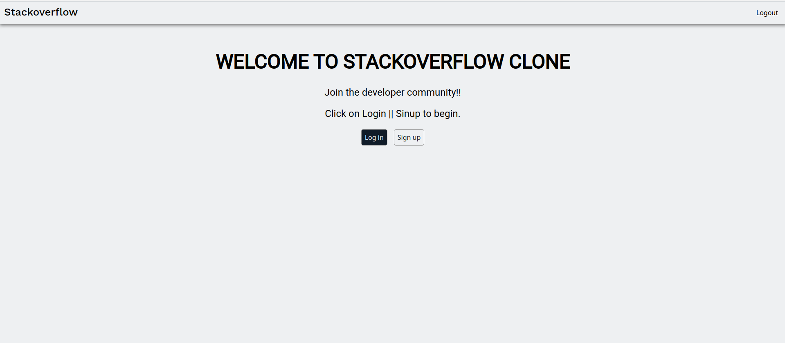
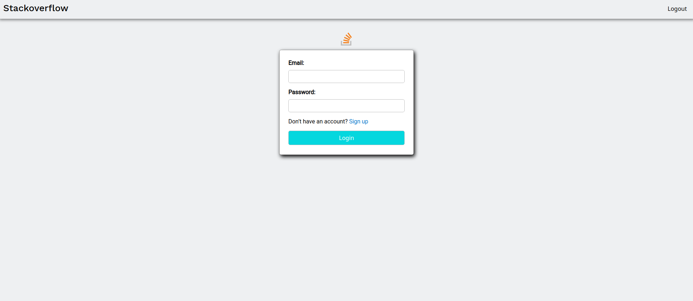
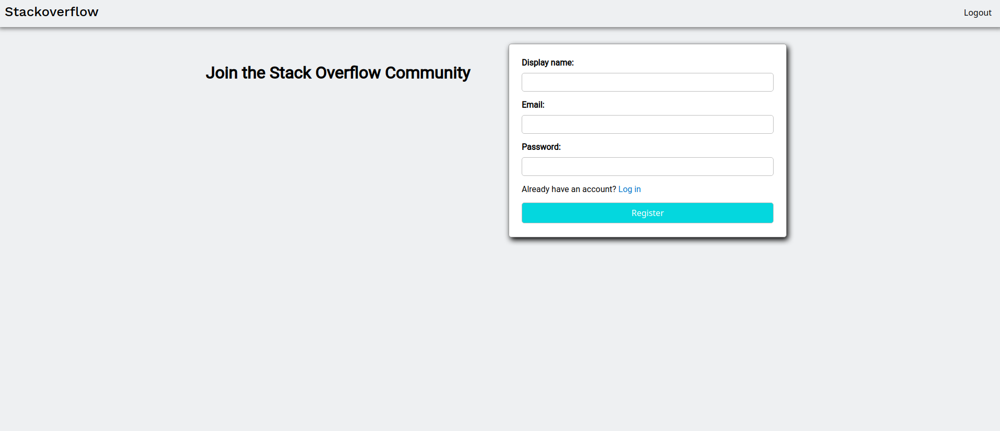
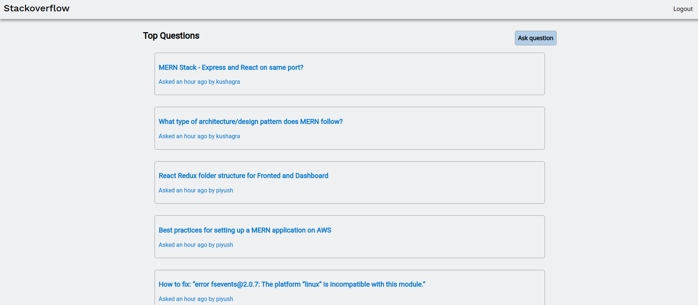
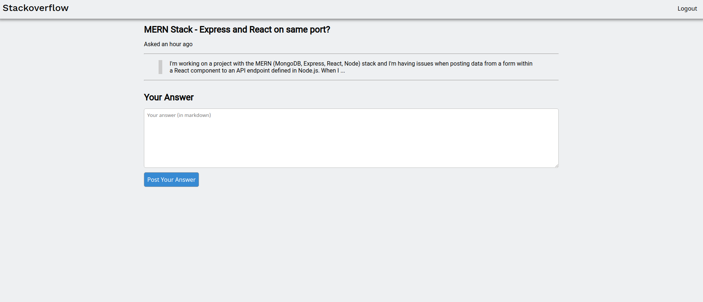

# stackoverflow-clone

#Video Tutorial
[https://drive.google.com/file/d/18AF6QQmXStnnHIsqHXPV6Y0oRF81nTuH/view?usp=sharing]

## UI

## Home

## Login

## Signup

## Questions

## Answering Questions

## :rocket: Tecnologias

<ul>
  <li>Nodemon</li>
  <li>MongoDB</li>
  <li>Mongoose</li>
  <li>Express</li>
  <li>Cors</li>
  <li>Express</li>
  <li>axios</li>
  <li>React</li>
  <li>React-Router</li>
  <li>Bcrypt</li>
  <li>body-parser</li>
</ul>

Quicky setup:

- Install all depedencies
  - Client side: on the `client` directory, type `npm install`
  - Server side: on the `server` directory, type `npm install`
- Run it on node.js:
  - Client side: on the `client` directory, type `npm start`
  - Server side: on the `server` directory, type `npm start`
